# Fluxos dos Comandos do Ameciclo Bot

## Comando: start
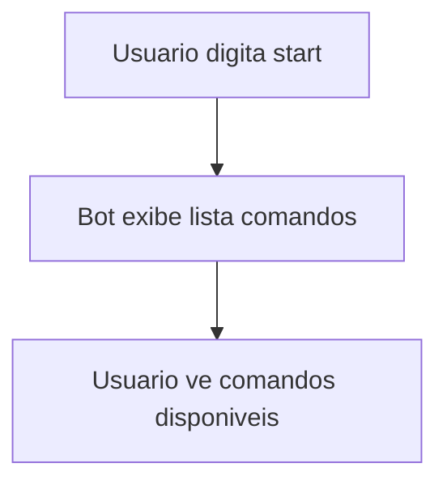

## Comando: help
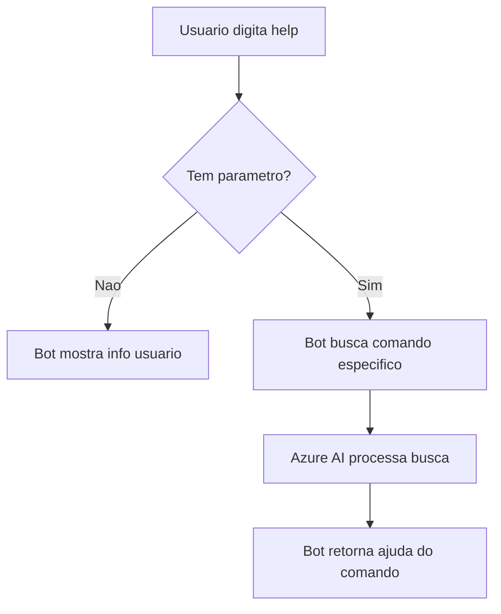

## Comando: evento
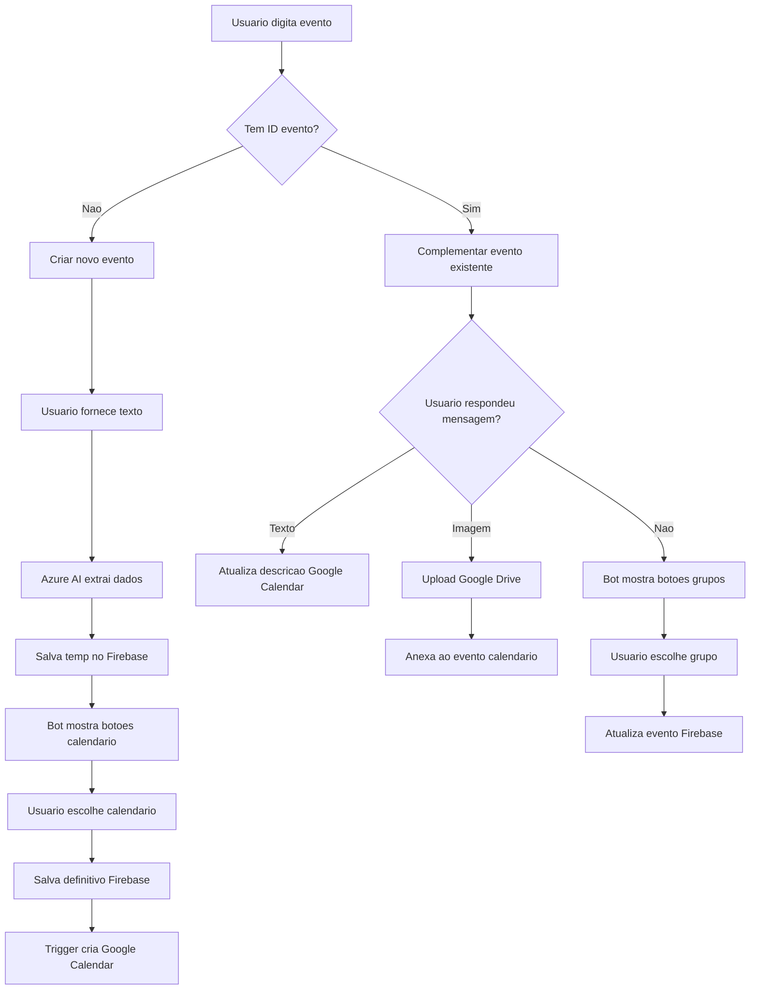

## Comando: ajudante_financeiro
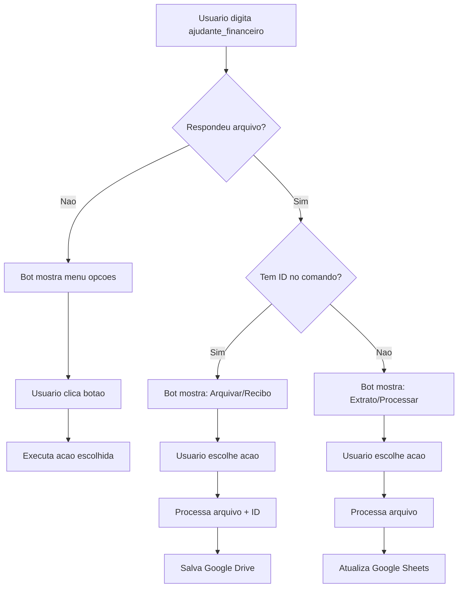

## Comando: pedido_de_informacao
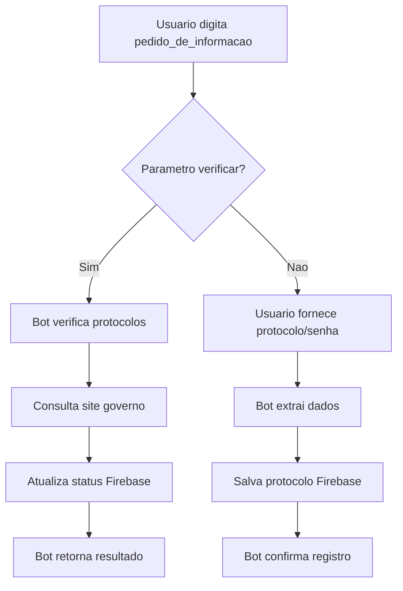

## Comando: pauta
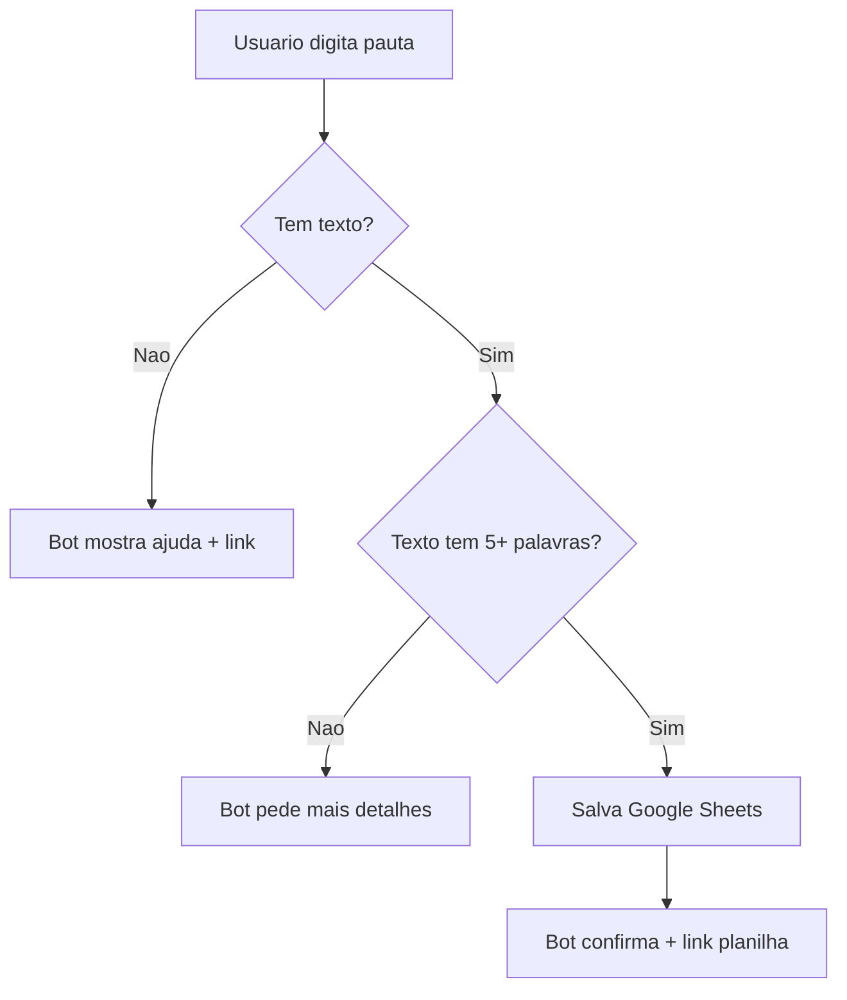

## Comando: clipping
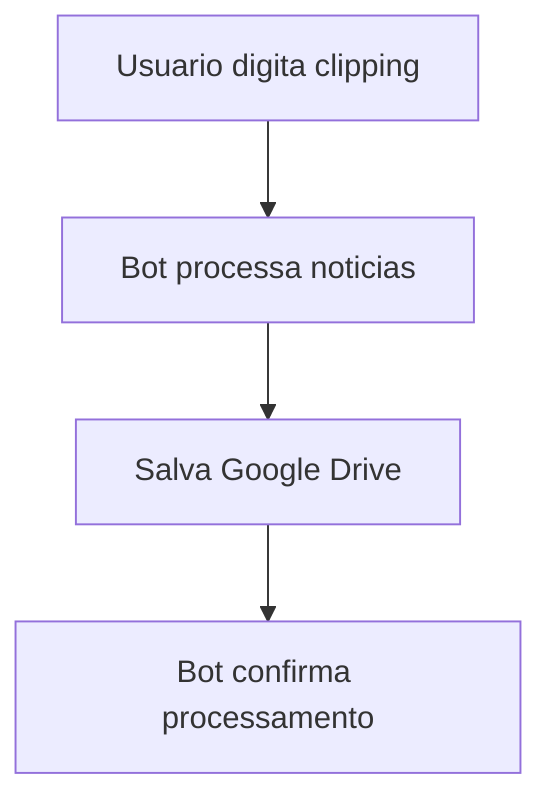

## Comando: enquete
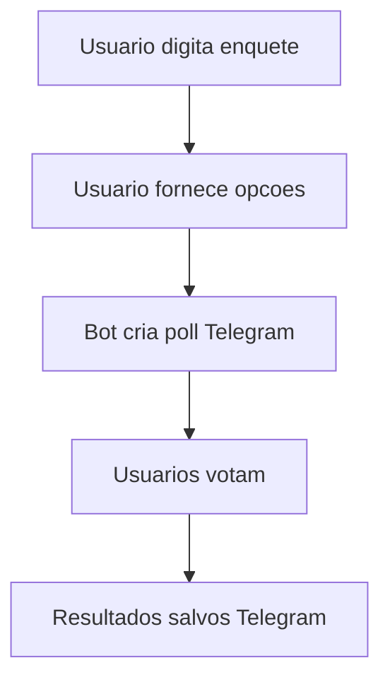

## Comando: transcrever
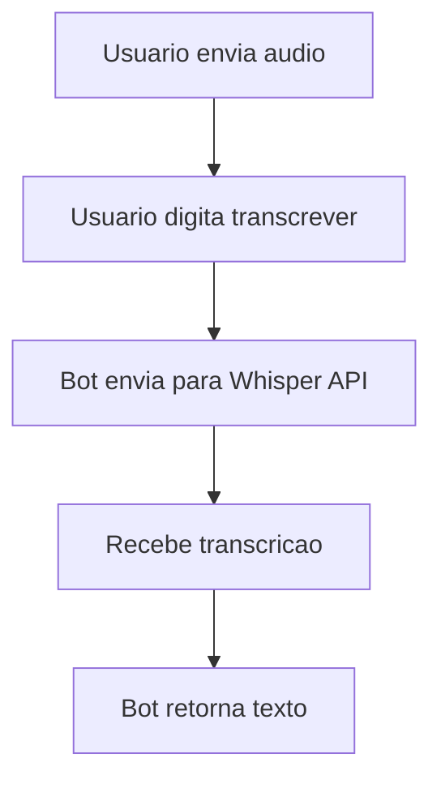

## Fluxo: Pagamento (Automatico)
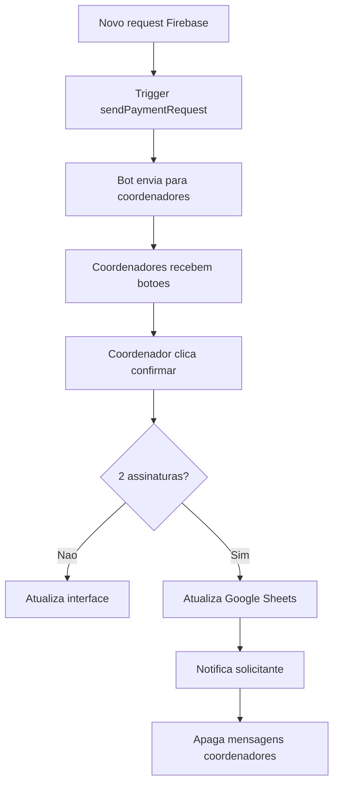

## Schedulers Automaticos
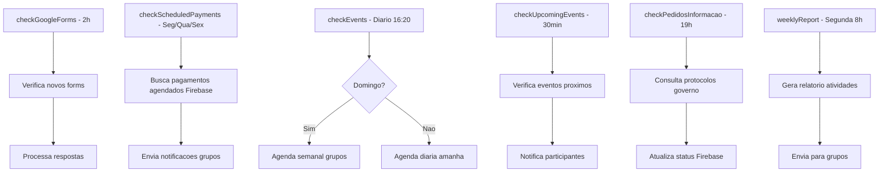

## Locais de Armazenamento

### Firebase Realtime Database
- `/requests/{id}` - Solicitacoes pagamento
- `/calendar/{id}` - Eventos temporarios
- `/temp_events/{id}` - Eventos em criacao
- `/protocols/{id}` - Protocolos LAI
- `/users/{id}` - Dados usuarios

### Google Drive
- Comprovantes pagamento
- Extratos bancarios
- Arquivos eventos
- Documentos gerados

### Google Sheets
- Planilhas financeiras
- Pautas reunioes
- Controle projetos
- Relatorios

### Google Calendar
- Eventos criados
- Agenda grupos trabalho